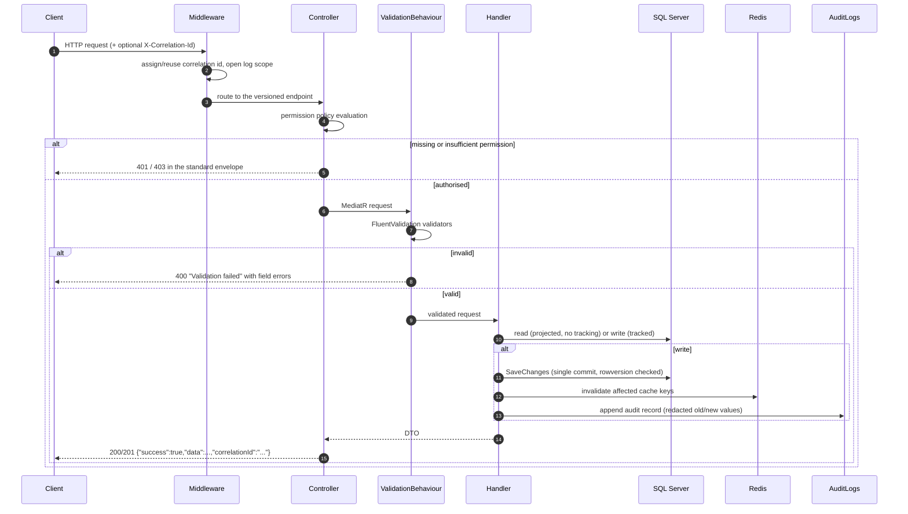
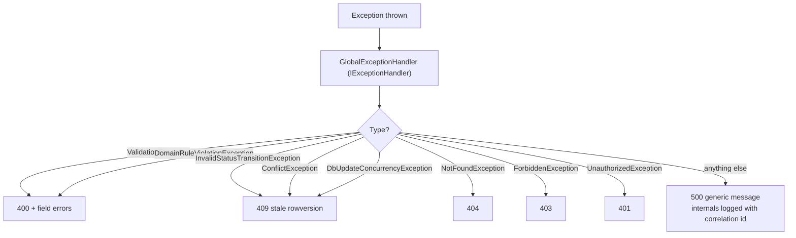

# Request flow

```mermaid
sequenceDiagram
    autonumber
    participant C as Client
    participant MW as Middleware
    participant CT as Controller
    participant VB as ValidationBehaviour
    participant H as Handler
    participant DB as SQL Server
    participant CA as Redis
    participant AU as AuditLogs

    C->>MW: HTTP request (+ optional X-Correlation-Id)
    MW->>MW: assign/reuse correlation id, open log scope
    MW->>CT: route to the versioned endpoint
    CT->>CT: permission policy evaluation
    alt missing or insufficient permission
        CT-->>C: 401 / 403 in the standard envelope
    else authorised
        CT->>VB: MediatR request
        VB->>VB: FluentValidation validators
        alt invalid
            VB-->>C: 400 "Validation failed" with field errors
        else valid
            VB->>H: validated request
            H->>DB: read (projected, no tracking) or write (tracked)
            alt write
                H->>DB: SaveChanges (single commit, rowversion checked)
                H->>CA: invalidate affected cache keys
                H->>AU: append audit record (redacted old/new values)
            end
            H-->>CT: DTO
            CT-->>C: 200/201 {"success":true,"data":...,"correlationId":"..."}
        end
    end
```

## Failure mapping

```mermaid
flowchart TD
    X[Exception thrown] --> EH["GlobalExceptionHandler (IExceptionHandler)"]
    EH --> V{"Type?"}
    V -->|ValidationException| E400[400 + field errors]
    V -->|DomainRuleViolationException| E400
    V -->|InvalidStatusTransitionException| E409[409 + both statuses]
    V -->|ConflictException| E409
    V -->|DbUpdateConcurrencyException| E409[409 stale rowversion]
    V -->|NotFoundException| E404[404]
    V -->|ForbiddenException| E403[403]
    V -->|UnauthorizedException| E401[401]
    V -->|anything else| E500["500 generic message<br/>internals logged with correlation id"]
```
